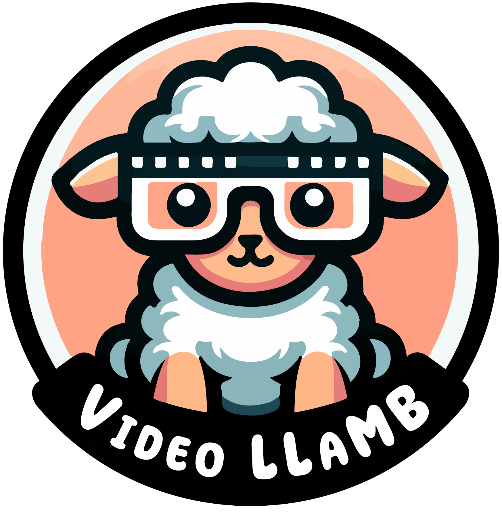
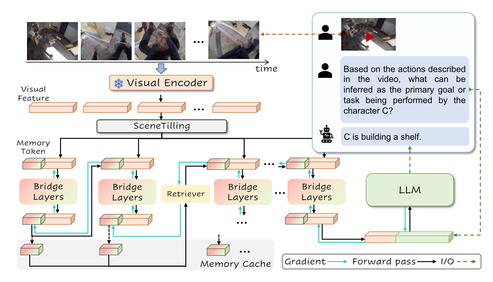
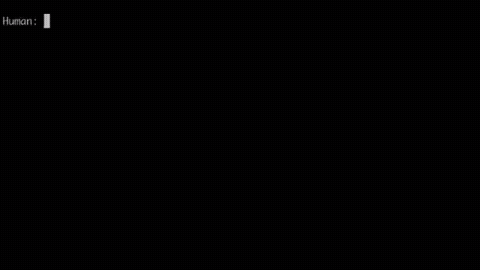
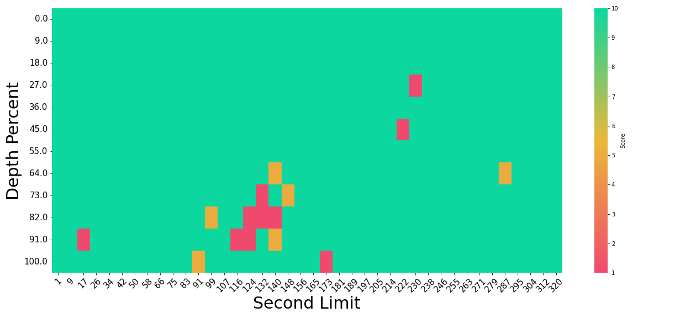

<p align="center">
    
</p>

<div align="center">

# VideoLLaMB: Long Video Understanding with Recurrent Memory Bridges


<!-- [](https://arxiv.org/abs/<INDEX>)
[](https://<CONFERENCE>) -->

</div>


Recent advancements in large-scale video-language models, demonstrate remarkable capabilities in real-time planning and interaction with real-world environments, yet their training is constrained by high computational costs and limited annotated datasets. Traditional methods, like video compression and sliding window techniques, often compromise critical visual information or disrupt semantic flow. In addition, current predesigned QA benchmarks fail to adequately assess long video understanding due to inherent biases from static image features and the base LLM. To address these issues, we introduce VideoLLaMB, a framework utilizing Memory Bridge Layers with recurrent memory tokens to encode entire video content without discarding vital information. We also propose SceneTilling algorithm to split video into semantic units to keep the semantic flow. Finally, We present the "Needle in a Video Haystack" benchmark to evaluate long video understanding over needle of different modalities comprehensively.




Table of Contents
- [Install](#install)
- [Quick Start with CLI](#quickstart-with-cli)
- [Streaming Caption with CLI](#streaming-video-caption-with-cli)
- [Demo](#demo)
- [Train](#train)
- [Evaluate](#evaluate)
- [Model Zoo](#model-zoo)
- [Citation](#citation)
- [Acknowledgement](#acknowledgement)

## Install

1. Clone this repository and navigate to VideoLLaMB folder
```bash
git clone https://github.com/nlco-bigai/VideoLLaMB.git
cd VideoLLaMB
```

2. Install Package
```bash
conda create -n videollamb python=3.10 -y
conda activate videollamb
pip install --upgrade pip
pip install -e .
conda install ffmpeg
```

3. Install additional packages for training cases
```bash
pip install -e ".[train]"
pip install flash-attn --no-build-isolation
pip install flash-attn --no-build-isolation --no-cache-dir
```


## QuickStart With CLI

Download the checkpoint, place it to the `checkpoints` directory, then run following command:
```bash
python -m llava.serve.cli --model-path checkpoints/videollamb-llava-1.5-7b --video-file XXX.mp4
```




## Streaming Video Caption with CLI

Download the checkpoint, place it to the `checkpoints` directory, then run following command:
```bash
python -m llava.serve.cli_streaming --model_path checkpoints/videollamb-llava-1.5-7b
```


https://github.com/user-attachments/assets/96c32452-f910-4c6c-9feb-0e98134d45a1


## Gradio Demo

Download the checkpoint, place it to the `checkpoints` directory, then run following command:
```bash
python -m llava.serve.gradio_demo
```


https://github.com/user-attachments/assets/2ea521e5-4bf2-415c-b20d-f5663c93af57


## Train


1. Prepare data

We combine the video instruction from [PLLaVA](https://github.com/magic-research/PLLaVA) and image instruction from [LLaVA](https://github.com/haotian-liu/LLaVA) for training. Please check [DATA](playground/DATA.md) for details.

2. Prapare model weights for initialization

Our model is initialized on LLaVA, you can download the [llava-v1.5-7b](https://huggingface.co/liuhaotian/llava-v1.5-7b), and put it to `checkpoints/llava-v1.5-7b`. For visual encoders, we select them from LanguageBind, you can download [LanguageBind_Image](https://huggingface.co/LanguageBind/LanguageBind_Image) and [LanguageBind_Video_merge](https://huggingface.co/LanguageBind/LanguageBind_Video_merge), and put them to `checkpoints/LanguageBind_Image` and `checkpoints/LanguageBind_Video_merge`


3. Start Training

Training takes 23 hours for LLaVA-1.5-7B in 4-A800-80G

```bash
bash scripts/finetune_video_image.slurm # bash
sbatch scripts/finetune_video_image.slurm # slurm cluster
```

We also provide a script to backpropagate the LLM loss to the bridge for each recurrent iteration.

```bash
bash scripts/finetune_video_image_loss.slurm # bash
sbatch scripts/finetune_video_image_loss.slurm # slurm cluster
```


## Evaluate

1. Prepare data

We provide evaluation pipelines for [EgoScheme](https://egoschema.github.io/), [NExTQA](https://egoschema.github.io/), [EgoPlan](https://github.com/ChenYi99/EgoPlan?tab=readme-ov-file#egoplan-evaluation-data), and [MVBench](https://huggingface.co/datasets/OpenGVLab/MVBench). Please check [DATA](playground/DATA.md) for details.

2. Start Evaluating 

a. Traditional Benchmark

```bash
bash scripts/eval/egoschema.sh # egoschema
bash scripts/eval/nextqa.sh # nextqa
bash scripts/eval/egoplan.sh # egoplan
bash scripts/eval/mvbench.sh # mvbench
```

b. MM-NIAVH

check our benchmark [Needle In A Video Haystack (NIAVH)](https://github.com/bigai-nlco/MM-NIAVH)





## Model Zoo

|Model      |Base Model      |  Training Data |  Download Link       | 
| ------------- | ------------- | -------- |  ------------- |
| VideoLLaMB-7B| llava-v1.5-7b | [magic_json](https://huggingface.co/datasets/cathyxl/magic_jsons), [LLaVA](https://huggingface.co/datasets/liuhaotian/LLaVA-Instruct-150K)        | [🤗videollamb-llava-1.5-7b](https://huggingface.co/ColorfulAI/VideoLLaMB)        | 
| VideoLLaMB-7B-Mem (MM-NIAVH)| llava-v1.5-7b | [magic_json](https://huggingface.co/datasets/cathyxl/magic_jsons), [LLaVA](https://huggingface.co/datasets/liuhaotian/LLaVA-Instruct-150K)        | [🤗videollamb-mem-llava-1.5-7b](https://huggingface.co/ColorfulAI/VideoLLaMB_Mem)        | 


## Acknowledgement

Model: 
- [LLaVA](https://github.com/haotian-liu/LLaVA)
- [Video-LLaVA](https://github.com/PKU-YuanGroup/Video-LLaVA)
- [recurrent-memory-transformer](https://github.com/booydar/recurrent-memory-transformer)

Data:
- [PLLaVA](https://github.com/magic-research/PLLaVA)

Demo:
- [videollm-online](https://github.com/showlab/videollm-online)

## Citation

```bibtex
@misc{mm-niavh,
    title={MLLM Pressure Test: Needle In A Video Haystack},
    author={Wang, Yuxuan and Xie, Cihang and Liu, Yang and Zheng, Zilong},
    publisher={github},
    url={https://github.com/bigai-nlco/NeedleInAVideoHaystack},
    year={2024}
}

@article{videollamb,
    title={VideoLLaMB: Long Video Understanding with Recurrent Memory Bridges},
    author={Wang, Yuxuan and Xie, Cihang and Liu, Yang and Zheng, Zilong},
    journal={arxiv},
    year={2024}
}
```

